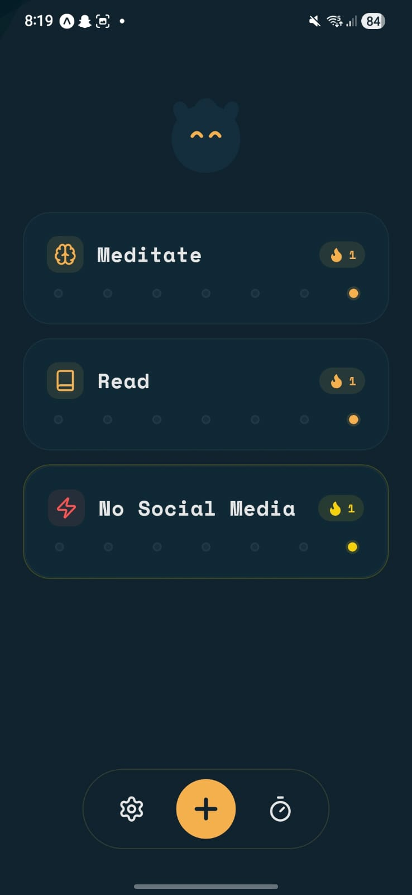
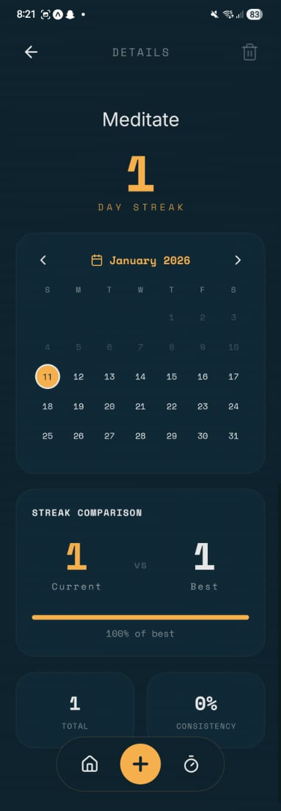
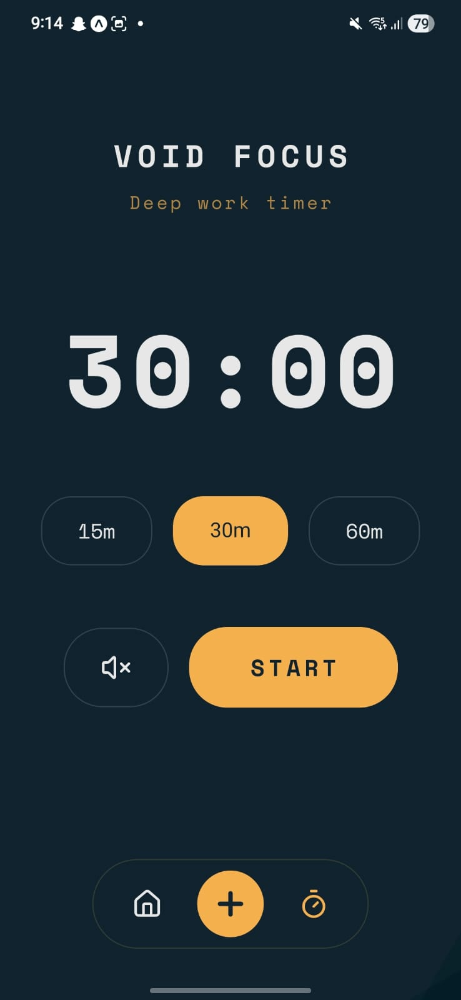
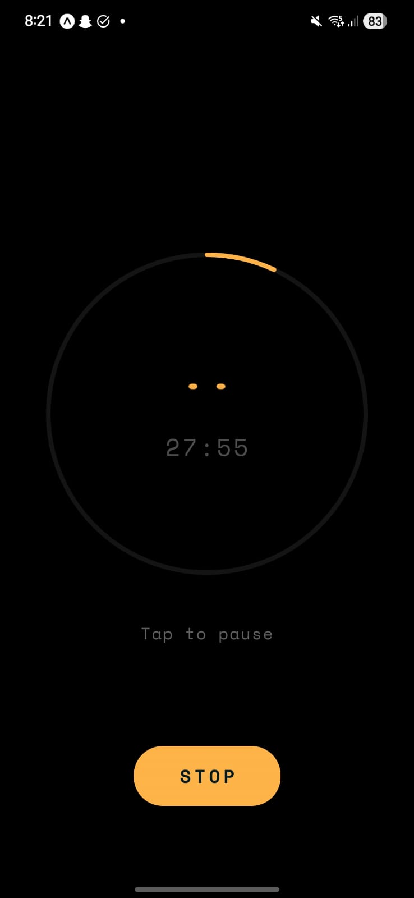
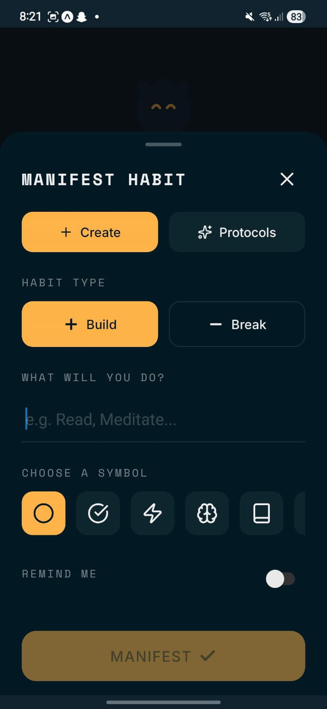
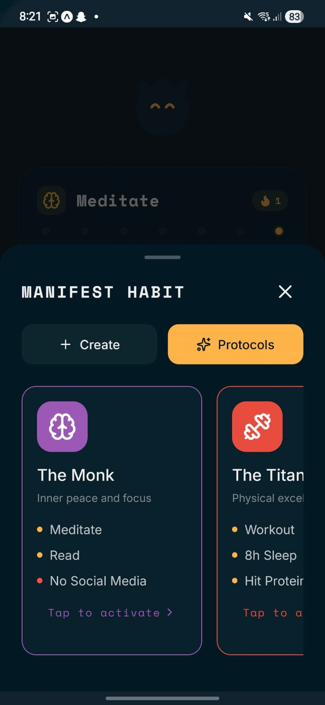

<p align="center">
  
</p>

# Void Tracker

A lo-fi habit tracking app with a dark, atmospheric aesthetic. Build positive habits and break negative ones with the help of the void.


## ✨ Features

### 📊 Habit Tracking
- **Build habits** (positive) - Things you want to do daily
- **Break habits** (negative) - Things you want to avoid
- Interactive sparkline cards showing your 7-day history
- Full calendar view with historical data

### 🎯 Streak System
- Current streak vs. longest streak comparison
- Smart streak calculation for both habit types
- Visual progress bar showing progress toward your best

### 🧘 Focus Timer
- Immersive OLED-black focus mode
- Circular timer with animated eye that watches your progress
- Full-screen distraction-free experience
- Haptic feedback on start/complete

### 📦 Protocols (Preset Bundles)
Quick-start your journey with curated habit bundles:
- **The Monk** - Meditate, Read, No Social Media
- **The Titan** - Workout, 8h Sleep, Protein
- **The Dopamine Detox** - No Sugar, No Doomscrolling, Walk

### 🐱 Watcher Avatar
- Cute cat avatar that reflects your daily progress
- Eyes change based on completion percentage
- Visual motivation to keep your streak going

### 🔔 Reminders
- Set daily reminders for each habit
- Local notifications at your chosen time

### 🔊 Audio Feedback
- **Habit Sounds**: Satisfying "set/unset" sound effects
- **Focus Ambience**: Looping "Sleepy Cat" sound during deep work
- **Sound Controls**: Toggle sounds easily from the Focus menu

## 🛠️ Tech Stack

- **Framework:** React Native with Expo
- **Navigation:** Expo Router (file-based)
- **State Management:** Zustand
- **Database:** SQLite (Drizzle ORM)
- **Animations:** React Native Reanimated
- **Styling:** StyleSheet with custom theme

## 🚀 Getting Started

### Prerequisites
- Node.js 18+
- npm or yarn
- Expo Go app (for testing on device)

### Installation

```bash
# Clone the repository
git clone https://github.com/yourusername/void-tracker.git
cd void-tracker

# Install dependencies
npm install

# Start the development server
npx expo start -c
```

### Running on Device
1. Install **Expo Go** from App Store or Play Store
2. Scan the QR code from the terminal
3. The app will load on your device

### Building for Production

```bash
# Install EAS CLI
npm install -g eas-cli

# Login to Expo
eas login

# Build Android APK
eas build --platform android --profile preview

# Build for iOS (requires Apple Developer account)
eas build --platform ios --profile production
```

## 📁 Project Structure

```
void-tracker/
├── app/                    # Expo Router pages
│   ├── _layout.tsx         # Root layout
│   ├── index.tsx           # Home screen
│   ├── focus.tsx           # Focus timer
│   ├── settings.tsx        # Settings page
│   └── habit/[id].tsx      # Habit detail page
├── src/
│   ├── components/         # Reusable components
│   │   ├── VoidDock.tsx    # Bottom navigation
│   │   ├── CreateHabitSheet.tsx
│   │   ├── WatcherAvatar.tsx
│   │   └── ...
│   ├── stores/             # Zustand stores
│   │   ├── useHabitStore.ts
│   │   └── useFocusStore.ts
│   ├── db/                 # Database setup
│   │   ├── index.ts
│   │   └── schema.ts
│   ├── theme/              # Colors & typography
│   └── utils/              # Helpers
└── assets/                 # Images & fonts
```

## 🎨 Design Philosophy

- **Dark aesthetic** - OLED-friendly deep blues and blacks
- **Lo-fi vibes** - Grain overlay, soft glows, minimal UI
- **Haptic feedback** - Physical feedback for interactions
- **Gamification** - Streaks, avatar emotions, progress tracking

## 📱 Screenshots

<p align="center">
  
  
  
  
</p>

<p align="center">
  
  
</p>

## 🤝 Contributing

Contributions are welcome! Feel free to open issues or submit PRs.

## 📄 License

MIT License - feel free to use this for your own projects.


